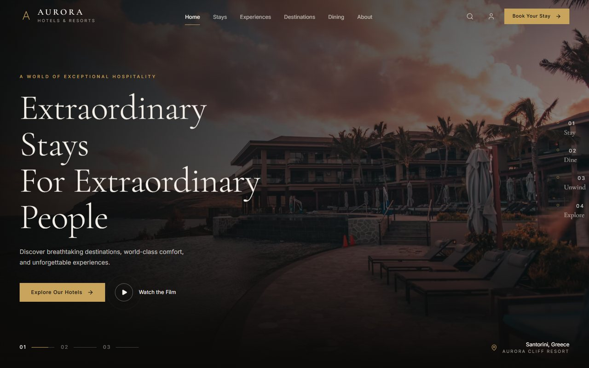
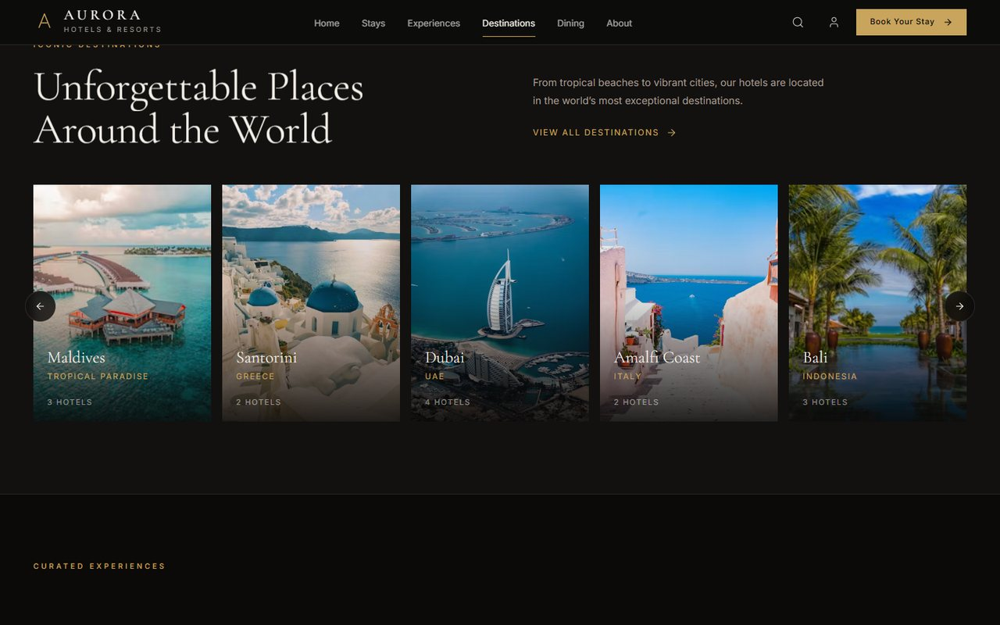
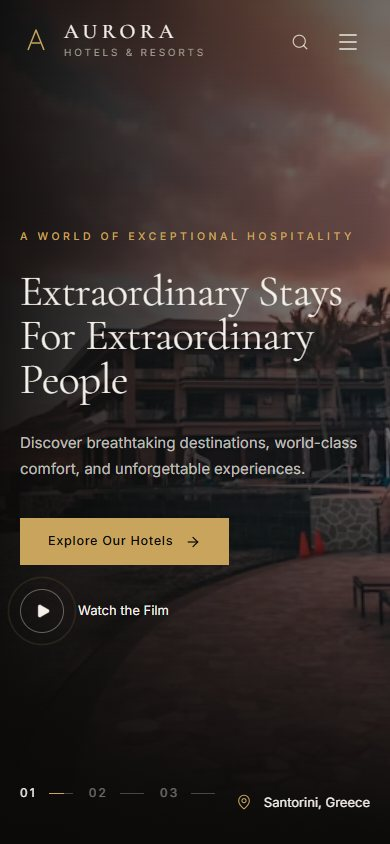

# Aurora Hotels & Resorts

Luxury hotel and resort showcase — rotating destination hero, rooms, experiences and seasonal offers. React 19 + TypeScript + Vite, Tailwind CSS v4, Framer Motion, Lucide icons.

**Live:** https://aurora-hotels-nine.vercel.app



```bash
npm install
npm run dev      # http://localhost:5173
npm run build    # production build in dist/
```

## Structure

- `src/sections/` in scroll order: `Hero` (three rotating property slides with a chapter index, slide counter and location badge) → `Rooms` → `Destinations` (horizontal rail of properties) → `Experiences` → `Offers`.
- `src/components/` — `Navbar`, `Img` (CDN image with a blurred placeholder), `SplitLines`, `Reveal`, `Overlays` (the booking and search dialogs), `Footer`.
- `src/data/content.ts` — properties, rooms, destinations, experiences, offers and all copy. Edit content here, not in sections.
- `src/hooks/` — `useSectionProgress`, `useCountUp`, `useMediaQuery`.
- `src/lib/` — `image.ts` (Unsplash CDN URLs + `srcset`), `ui.ts` (easing, scroll helpers, dialog state).
- Design tokens live in the `@theme` block of `src/index.css` — Tailwind v4, so there is no `tailwind.config.js`.

## Notes

`useSectionProgress` wraps `useScroll` in an identity `useTransform`, which keeps Framer from handing scroll-linked values to the browser's native ScrollTimeline where multi-stop ranges desync.

Motion respects `prefers-reduced-motion` through `MotionConfig reducedMotion="user"`. Any grid cell wrapping a horizontal rail needs `min-w-0`, or the rail sets the column width and the page overflows sideways on a phone.

Images are served from the Unsplash CDN with a blurred low-quality placeholder behind each one; swap the photo ids in `content.ts` for the client's own photography before launch.

## Screens

| Destinations | On a phone |
| --- | --- |
|  |  |
